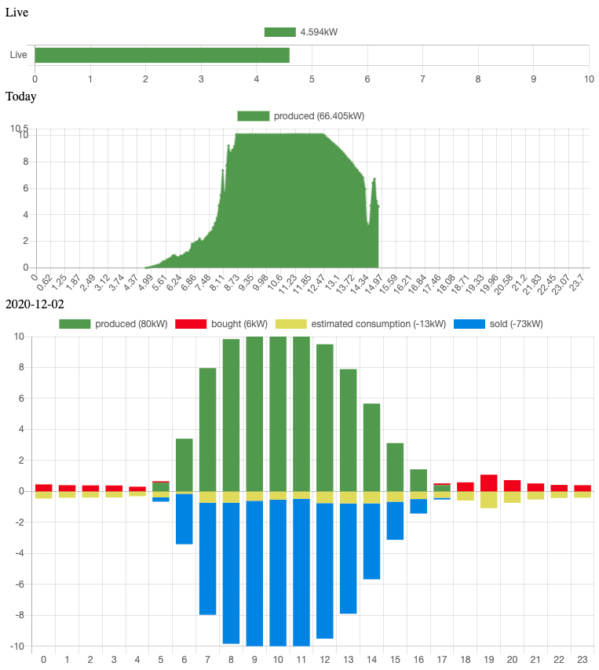

# Solar Power History
Shows History of Power Production/Consumption of Fronius inverter and EnergyAustralia Smart Meter.

It will show and store all available data per day/hourly:
- produced kW by solar
- bought kW from grid
- sold kW to grid
- calculates the consumed kW with pervious values.

## Requirements
- Fronius Inverter: enable logging every 5sec, have USB-drive plugged it, accessible via api
- EnergyAustralia Smart Meter and login credentials
- Maybe run the data.php once a day during operation time of the inverter
- file write access to ./data subfolders
